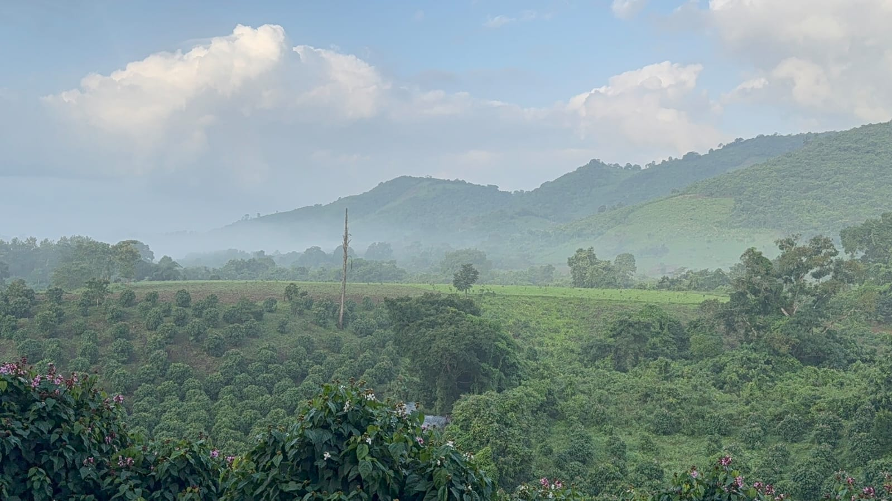

<!--
	╔══════════════════════════════════════════════════════════════════╗
	║  AI Story Song Suggester                                           ║
	║  A playful, experimental recommender that maps stories & images   ║
	║  to songs using Spotify datasets, simple ML, and creative mapping ║
	╚══════════════════════════════════════════════════════════════════╝
-->

# 🎧 AI Story Song Suggester


[](https://github.com/SaiShashank-10/ai-song-suggester/actions)


Turn your story or picture into a playlist. AI Story Song Suggester is an exploratory project that analyzes images and/or short story-like text and recommends songs from a local Spotify-derived dataset that match mood, atmosphere, or themes. It's a prototyping playground — think demos, notebooks, and a lightweight web UI.

✨ Features

- 🖼️ Image analysis: extract visual cues or labels from images to guide recommendations
- ✍️ Text-to-music: map short stories or mood descriptions to song clusters
- 🎛️ Data-driven: uses curated Spotify CSV datasets and lightweight clustering
- 🧪 Notebooks first: clear, replayable Jupyter notebooks for exploration and reproducibility

Why this project exists

Music is emotional — this project explores mapping semantic or visual signals to audio features so you can build story-driven playlists or creative soundtracks for short scenes.

---

## Table of Contents

- [🎧 AI Story Song Suggester](#-ai-story-song-suggester)
  - [Table of Contents](#table-of-contents)
  - [Demo](#demo)
  - [Quick start](#quick-start)
  - [Project structure](#project-structure)
  - [Datasets \& Notebooks](#datasets--notebooks)
  - [Examples](#examples)
  - [Development notes](#development-notes)
  - [Roadmap (ideas)](#roadmap-ideas)
  - [Contributing](#contributing)
  - [License](#license)
  - [Contact](#contact)

---

## Demo

Add a screenshot or GIF here to show the app in action. For example:



> Tip: run the notebooks in `notebooks/` for quick experiments and to generate example recommendations.

---

## Quick start

These instructions assume a typical Python + Node setup. If your `backend/` or `frontend/` uses a different stack, I can detect it and update this section.

1. Clone the repo

```powershell
git clone https://github.com/SaiShashank-10/ai-song-suggester.git
cd ai-song-suggester
```

2. (Optional) Python environment for notebooks & backend

```powershell
python -m venv .venv; .\.venv\Scripts\Activate.ps1
pip install --upgrade pip
pip install jupyter pandas numpy scikit-learn matplotlib seaborn pillow
# If backend uses FastAPI/Flask install those packages accordingly
```

3. Start Jupyter and open the notebooks

```powershell
jupyter lab
```

4. Frontend (if present)

```powershell
cd frontend
npm install
npm run dev # or npm start
```

5. Backend (if present)

```powershell
cd backend
# If Python: pip install -r requirements.txt; uvicorn main:app --reload
# If Node: npm install; npm start
```

If you want I can inspect `backend/` and `frontend/` and replace the placeholders above with exact commands.

---

## Project structure

Summary of what's in the repository now:

- backend/ — API server (checks needed to confirm tech stack)
- frontend/ — web UI (checks needed to confirm tech stack)
- notebooks/ — Jupyter notebooks and assets (image files, CSV datasets)
- README.md — this file

Notable files in `notebooks/`:

- `image_analysis.ipynb` — image feature extraction experiments
- `stage_2_music_data.ipynb`, `stage_3_recommender.ipynb` — dataset cleaning, clustering, and recommender experiments
- `spotify_dataset.csv`, `spotify_dataset_with_clusters.csv`, `spotify_songs.csv`, `spotify_songs_working.csv` — datasets
- `user_feedback.csv` — feedback sink for recommendations

---

## Datasets & Notebooks

The notebooks rely on CSV datasets in `notebooks/`. These include Spotify metadata and audio features. Before running long experiments, open the CSVs to check column names.

Quick CSV preview in PowerShell:

```powershell
Get-Content -Path notebooks\spotify_dataset_with_clusters.csv -TotalCount 10
```

---

## Examples

Programmatic example (pseudo): POST a short mood to `/recommend` and receive top songs.

```powershell
# Example: send a simple JSON to a local API (adjust host/port as needed)
curl -X POST http://localhost:8000/recommend -H "Content-Type: application/json" -d '{"text":"A quiet evening by the lake, mist and soft lights","top_n":10}'
```

Expected response: JSON array of song objects from the local CSV dataset (title, artist, preview_url, cluster, score).

---

## Development notes

- The repository currently prioritizes exploration; production concerns (auth, rate limiting, licensing of audio previews) are out of scope for now.
- Assumed recommendation flow: image -> labels/embeddings; text -> semantic embedding; map to cluster(s); return top-N songs by similarity or cluster score.
- If you'd like a minimal smoke-test endpoint, I can add a tiny FastAPI app that returns the top 10 songs from `spotify_songs_working.csv` for a hard-coded mood.

Edge cases to consider

- Empty or very short text queries
- Images without clear semantic labels
- Missing metadata in CSVs (nulls)

---

## Roadmap (ideas)

- [ ] Auto-detect backend/frontend tech and generate exact run instructions
- [ ] Create a reproducible demo endpoint (FastAPI + static sample CSV)
- [ ] Add CI workflow to run notebook tests (nbval) and linting
- [ ] Add a simple frontend demo page for uploading an image and showing recommendations

---

## Contributing

Contributions are welcome! Typical workflow:

1. Fork the repo
2. Create a feature branch
3. Add tests / update notebooks
4. Open a PR with a clear description and screenshots if applicable

Please include a short note if you change dataset columns or the recommendation contract (API schema).

---

## License

This repository does not include a license file yet. If you want a permissive license, consider adding an `MIT` or `Apache-2.0` license. Let me know and I can add a `LICENSE` file.

---

## Contact

If you want me to:

- Auto-generate runnable demo endpoints
- Inspect `backend/` and `frontend/` and update this README with precise run commands
- Add CI badges that reflect reality

Tell me which and I'll update the repo accordingly. 🚀

---

_Generated and styled on 2025-09-28_
